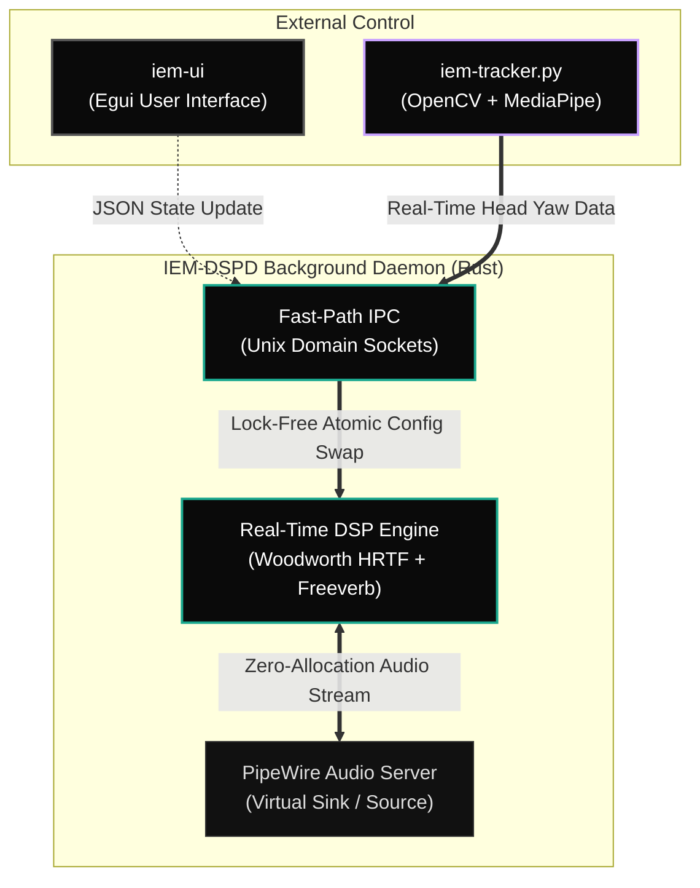

# iem-dspd — KZ Castor IEM DSP Daemon

High-performance, low-latency audio DSP pipeline engineered for the KZ Castor IEM.

## 🏗 System Architecture

## Core Features

1. **Bare-Metal PipeWire Integration:** Interfaces directly with PipeWire streams.
2. **Zero-Allocation Real-Time Thread:** All DSP algorithms operate on pre-allocated stack/heap memory without allocating during the audio callback, ensuring zero dropouts.
3. **Parametric Mastering:** 10-band zero-latency biquad PEQ.
4. **Immersive Spatial Audio:**
   * Woodworth Spherical-Head Model HRTF.
   * Internal LFO-driven auto-spin (orbital audio).
   * Freeverb FDN implementation for huge, reflection-rich room acoustics.
5. **Apple Vision Pro-Style World Lock:**
   * External Python script uses OpenCV and MediaPipe to calculate head yaw.
   * Feeds counter-rotation data directly to the Rust DSP fast-path via IPC Unix Socket (avoiding disk I/O).

## Documentation

See the [website documentation](website/doc/index.html) or `DOCS.md` for full installation, setup, and deployment instructions.
